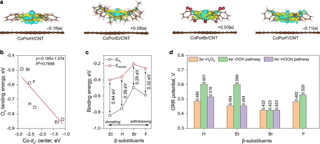
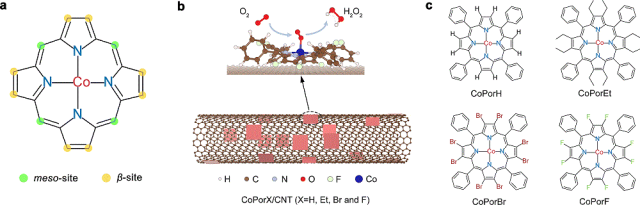
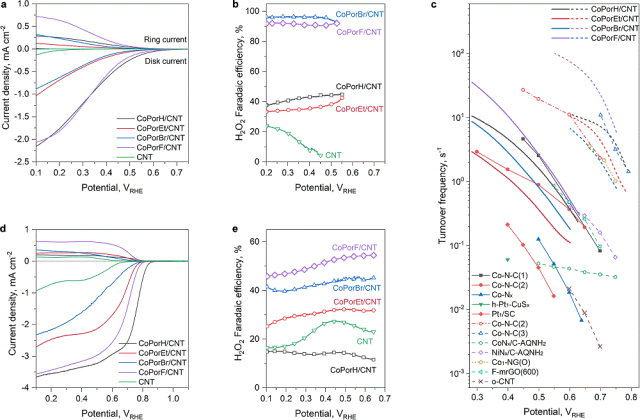

# Energy Environ. Sci.：CoPorX/CNT催化剂高效电化学合成H2O2

单原子钴-氮-碳（Co-N-C）催化剂催化氧还原反应（ORR）以可持续的生产过氧化氢（$H_2O_2$），但是精确的催化剂原子结构剪裁仍然困难，限制了实验设计和活性改进。

<!--more-->

## 1 Introduction

单原子钴-氮-碳（Co-N-C）催化剂催化氧还原反应（ORR）以可持续的生产过氧化氢（$H_2O_2$），但是精确的催化剂原子结构剪裁仍然困难，限制了实验设计和活性改进。基于此，**澳大利亚悉尼大学魏力博士和陈元教授、日本东北大学李昊教授（共同通讯作者）等人**报道了利用给电子的乙基（Et）或吸电子的溴（Br）和氟（F）取代基（CoPorX，其中X=H、Et、Br和F）替换了钴-四苯基卟啉的所有8个β-H原子，并使用CNTs基底构建了多相分子催化剂（HMCs）（CoPorX/CNT）。CoPorF/CNT催化剂是最佳催化剂，具有94%的H2O2选择性，周转频率（TOF）为3.51 s-1，过电位为200 mV。在双电极电解槽中，其H2O2产率可达10.76 molH2O2 gcat-1 h-1，并产生超过30000 ppm的无电解质H2O2溶液，是水处理和化学生产的理想选择。


图的解释及分析可以写到这里


### 2.1 Electron structure

首先研究了不同β-取代卟啉（H2PorX，X=H、Et、Br和F）和相应的钴卟啉的电子结构。最高占据分子轨道（HOMO）和最低未占分子轨道（LUMO）处计算的离域π-电子分布显示出明显的差异。对比H2PorH和金属化的CoPorH分子，乙基取代可以增加电子密度，离域π-轨道可以延伸到中位苯基。Br和F取代基从卟啉核积累电子，与它们的吸电子能力一致。这些卟啉和钴卟啉的分子轨道能级呈现出类似的趋势，导致从其计算的自旋极化部分态密度（pDOS）中发现的Co d电子分布变化。

### 2.2 Difference Charge

差分电荷密度（Δq）计算表明，CoPorH/CNT中的Co原子（Δq=-0.18|e|）和CoPorF/CNT（-0.11|e|）由于失去电子而变得更正，而CoPorBr/CNT和CoPorEt/CNT通过分别接受0.03|e|和0.08|e|而变得富电子。这些Δq值与相邻碳原子被O原子官能化的Co-N4催化剂模型上观察到的值相当。其1.012 µB的更大变化（从0.007到1.019 µB）表明可能的共自旋转变，这会显著改变CoPorF/CNT的电子性质和催化活性。因此，CNT基底可以与β-取代基协同调节Co性质。

## 2 Paper Info

Heterogeneous molecular Co-N-C catalysts for efficient electrochemical H2O2 synthesis. 

*Energy Environ. Sci.,* **2022**, DOI: 10.1039/D2EE02734H.

https://doi.org/10.1039/D2EE02734H.

